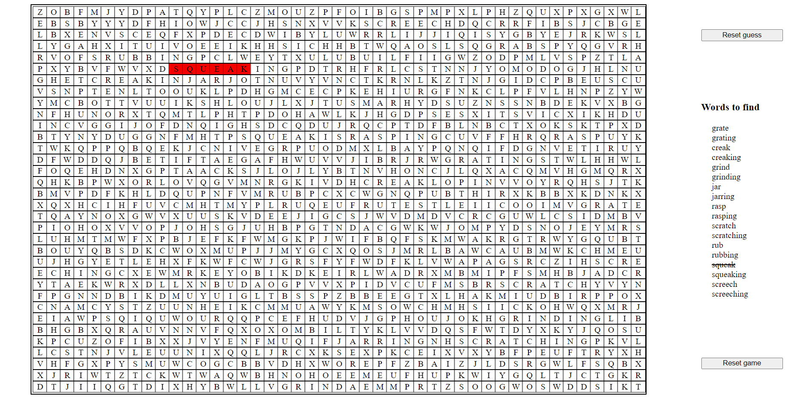

Creates a 45x34 grid. On start the User is prompted to input a word. Its synonyms then fetched from a dictionary api and randomly hidden inside the wordsearch grid. The synonmyms are also listed on the ui and striked off when found

